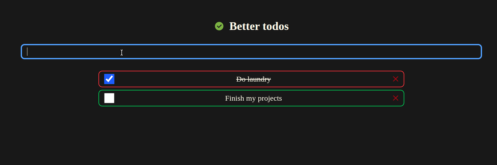

# Todo app for Apollo

This is a working example of a Todo app with all the basic features you may need.

I used Vite + TS + React + Tailwind CSS.

## How to run

Make sure you have [Node.js](https://nodejs.org/en) installed. Optionally, [PNPM](https://pnpm.io/) too. \
Also run `npm install` or `pnpm install` to install the necessary dependencies. \
Then run `npm run dev` or `pnpm run dev` to start the development server. \
Lastly, open [http://localhost:5173](http://localhost:5173/).

## License

This project is licensed under the [MIT LICENSE](./LICENSE).

The favicon came from [veryicon.com](https://www.veryicon.com/icons/business/vscode-program-item-icon/todo-2.html).
